# Flujo completo de una máquina virtual en OLVM

Este documento sigue una VM desde su creación hasta su eliminación y separa dos ideas que no deben mezclarse:

- **La definición de la VM:** permanece registrada en Engine aunque esté apagada.
- **La ejecución de la VM:** existe como un proceso QEMU/KVM dentro de un host cuando está encendida.

La comparación aproximada con vSphere sería:

| OLVM | Equivalencia aproximada en vSphere |
|---|---|
| Definición de VM en Engine | VM registrada en vCenter |
| Proceso QEMU/KVM en un host | VM ejecutándose en un host ESXi |
| Live migration | vMotion |
| Template | VM Template |
| QEMU Guest Agent | Parte de VMware Tools |

---

# 1. Flujo general del ciclo de vida

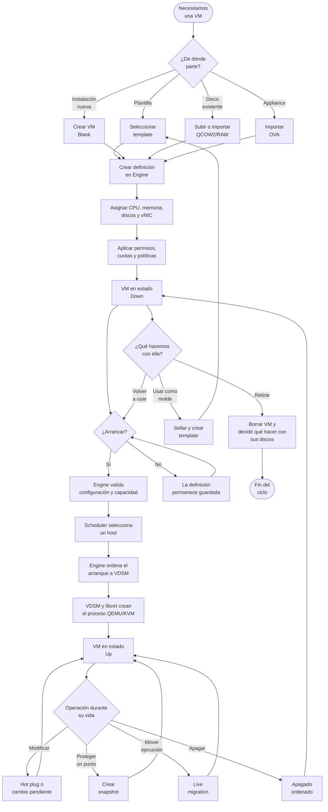

La VM puede recorrer el circuito `Down → Up → Down` muchas veces. Apagarla no elimina su definición ni sus discos.

---

# 2. Plano de control y plano de datos

Engine coordina la VM, pero no transporta continuamente sus paquetes ni sus bloques de disco.

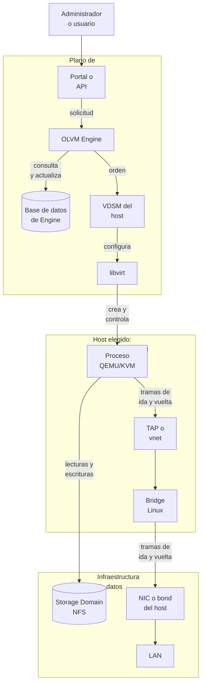

## Qué circula por cada camino

| Camino | Qué circula |
|---|---|
| Portal → Engine → VDSM → libvirt | Órdenes, configuración, estados y resultados |
| QEMU ↔ Storage Domain NFS | Lecturas y escrituras del disco virtual |
| vNIC → TAP/vnet → bridge → NIC | Tramas de red de la VM |

El Engine no lee cada bloque del disco ni conmuta cada trama de la VM.

---

# 3. Qué ocurre cuando pulsamos Ejecutar

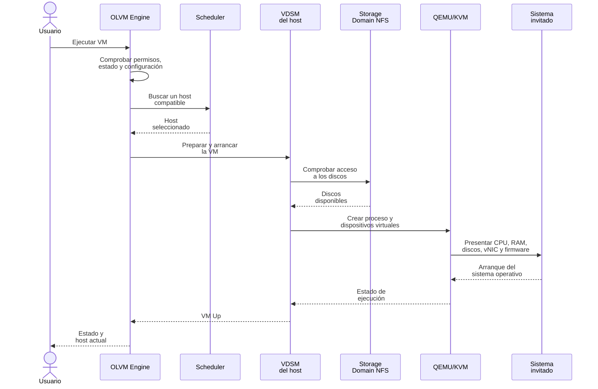

## Validaciones principales

Antes de arrancar, OLVM necesita encontrar una combinación válida:

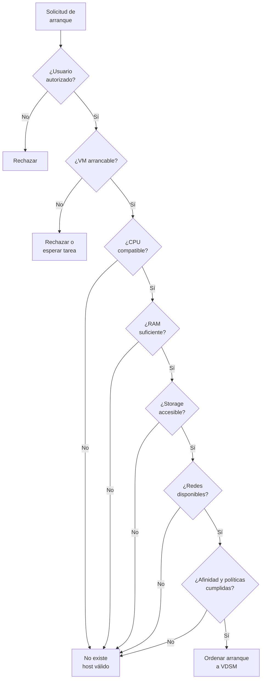

Por eso «el host tiene CPU libre» no demuestra que pueda ejecutar la VM. También deben encajar storage, redes, afinidad, permisos y compatibilidad.

---

# 4. Estados principales

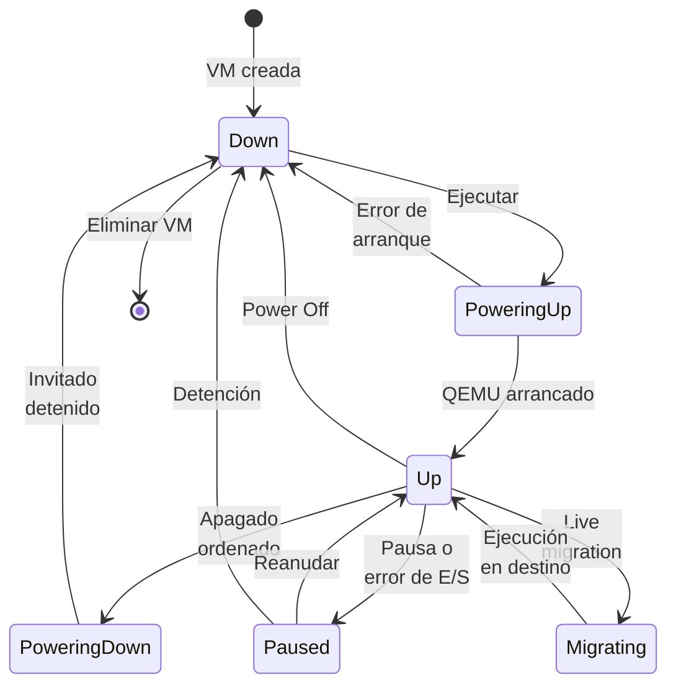

Este diagrama está simplificado. Una operación de discos puede mostrar además estados como `Image Locked` mientras la VM continúa teniendo su propio estado de ejecución.

## Down no significa inexistente

Cuando está `Down` permanecen:

- definición;
- discos;
- vNICs y MAC;
- permisos;
- snapshots;
- políticas;
- historial y eventos.

Lo que no existe es el proceso QEMU ejecutándola en un host.

---

# 5. Creación desde una plantilla

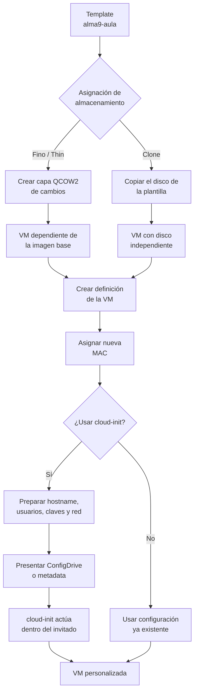

## Diferencia esencial

| Modalidad | Creación y consumo inicial | Relación con la plantilla |
|---|---|---|
| **Thin** | Se crea rápidamente y ocupa poco espacio inicialmente | Depende de la imagen base de la plantilla |
| **Clone** | Tarda más y consume el espacio de la copia | Copia el disco y queda independiente |

El template debe estar sellado para no duplicar hostname, claves SSH, `machine-id` u otras identidades.

---

# 6. Funcionamiento de la VM encendida

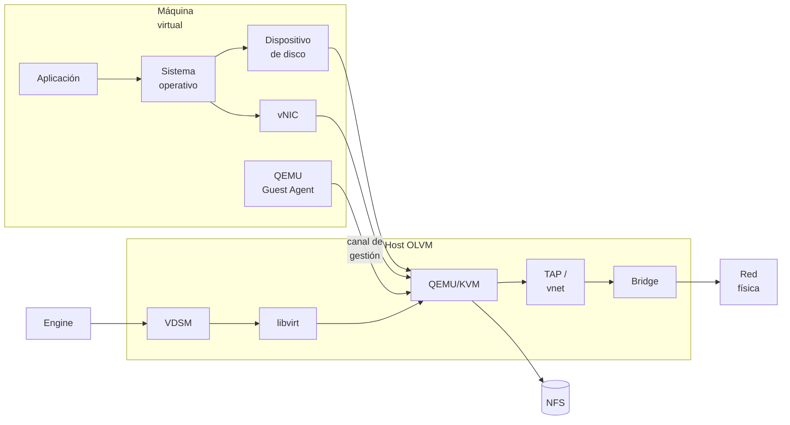

## Guest Agent frente a VDSM

| Componente | Dónde está | Función principal |
|---|---|---|
| **QEMU Guest Agent** | Dentro de la VM | Informa sobre IP y estado del invitado; permite apagado coordinado y otras operaciones |
| **VDSM** | En el host OLVM | Recibe órdenes de Engine y administra libvirt, las VMs, el almacenamiento y la red del host |

Una VM puede funcionar sin Guest Agent, pero Engine conocerá peor lo que sucede dentro de ella.

---

# 7. Flujo de un snapshot

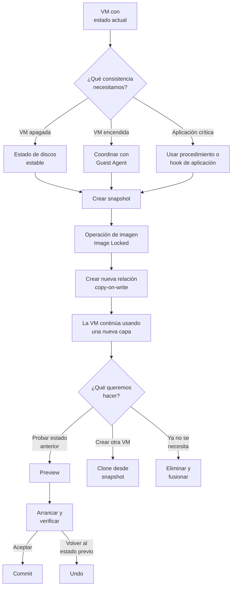

## Snapshot no es backup

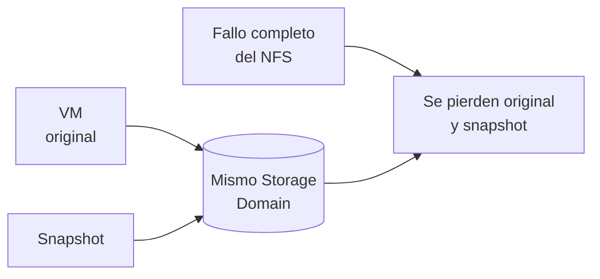

El snapshot depende de la cadena y del almacenamiento original. Un backup necesita otra copia, retención y un procedimiento probado de restauración.

---

# 8. Flujo de una live migration

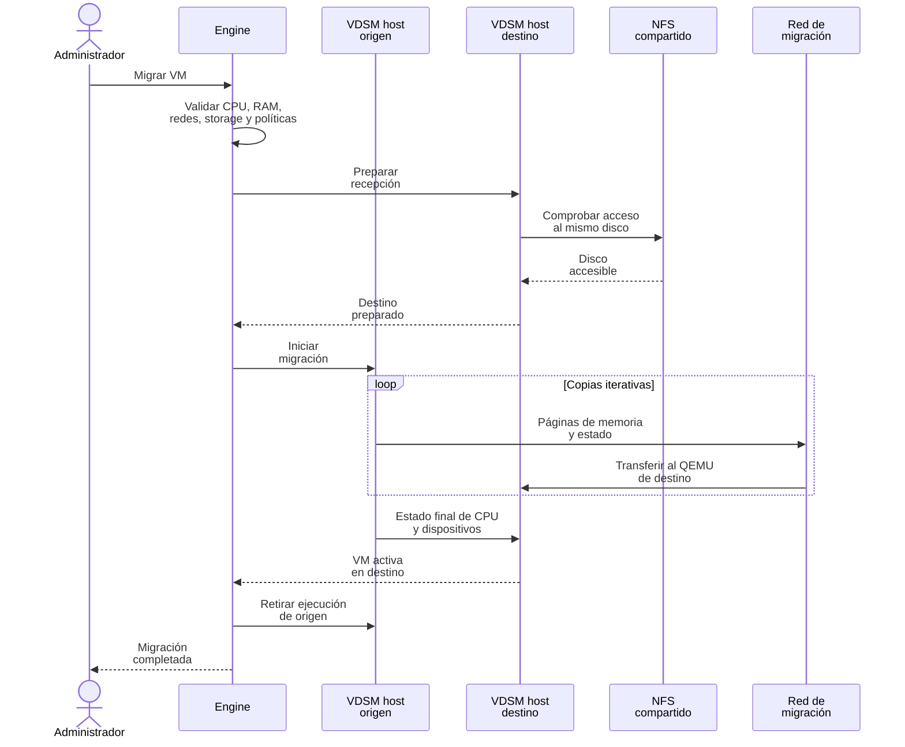

## Qué se mueve y qué permanece

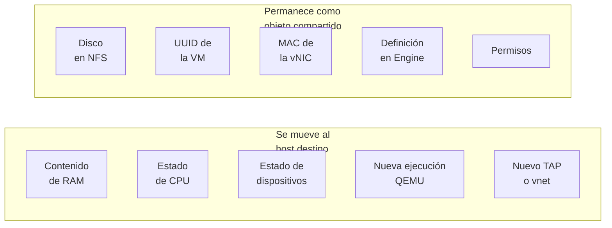

En una migración normal con NFS compartido no se copia el disco al host destino. Ambos hosts ya acceden al mismo Storage Domain.

---

# 9. Apagado y eliminación

## Apagado ordenado

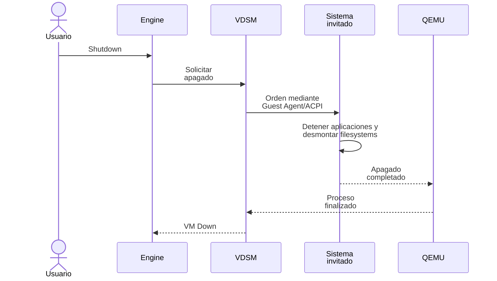

## Power Off

`Power Off` fuerza la retirada de la ejecución. Es parecido a cortar la alimentación de un servidor y puede dejar datos o filesystems inconsistentes.

## Eliminar la VM

Al borrar debemos distinguir:

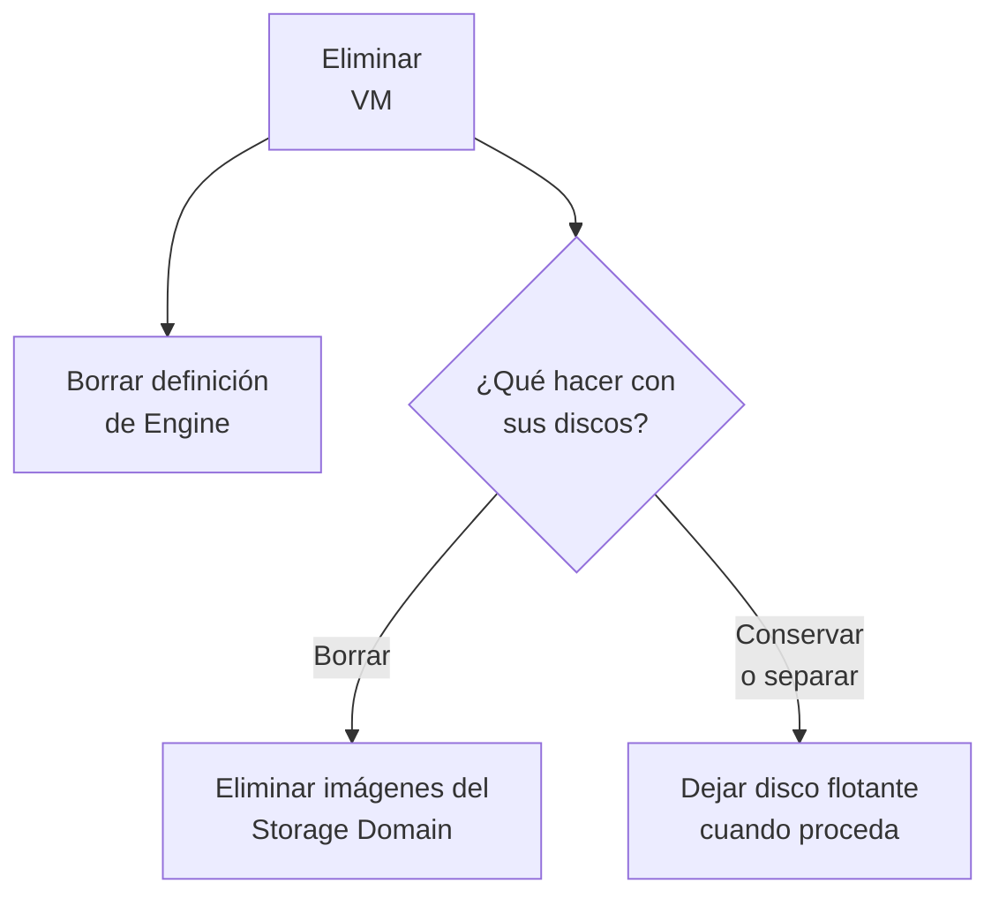

Borrar una VM no debe hacerse hasta identificar sus discos, snapshots, permisos y posibles dependencias.

---

# 10. El flujo en nuestra instalación

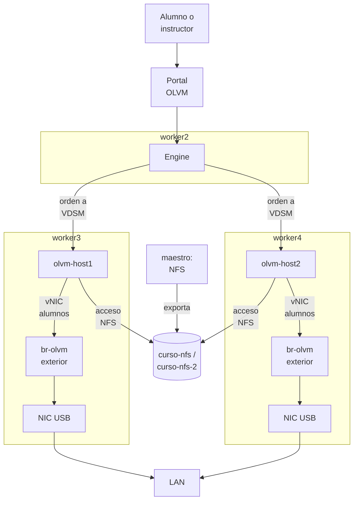

Una VM concreta se ejecutará en `olvm-host1` **o** en `olvm-host2`, no en los dos a la vez.

Su camino simplificado será:

| Camino | Recorrido simplificado |
|---|---|
| **Control** | Portal → Engine → VDSM del host elegido → libvirt → QEMU |
| **Disco** | QEMU → red interna → `curso-nfs`/`curso-nfs-2` → NFS de `maestro` |
| **Red de la VM** | vNIC → TAP/vnet → red lógica `alumnos` → NIC del host OLVM → `br-olvm` del worker exterior → NIC USB → LAN |

Durante una migración cambia el host que ejecuta QEMU y se crea el puerto TAP/vnet correspondiente en el destino. El disco continúa en NFS y la MAC de la VM permanece.

---

# 11. Reglas mentales para diagnosticar una VM

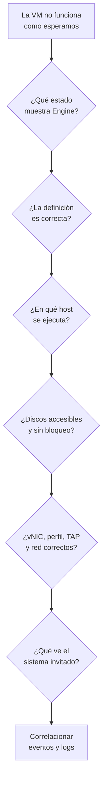

Las preguntas se hacen en este orden:

1. ¿Existe la VM y en qué estado está?
2. ¿Cuál es su definición de CPU, memoria, discos y red?
3. ¿En qué host está ejecutándose?
4. ¿Tiene acceso al Storage Domain?
5. ¿Qué camino sigue su vNIC?
6. ¿Guest Agent informa correctamente?
7. ¿El problema está en OLVM, en el host o dentro del invitado?

La frase final es:

> **Engine decide y coordina; VDSM ejecuta la orden; QEMU/KVM ejecuta la VM; NFS guarda sus discos; la red del host transporta sus tramas.**
